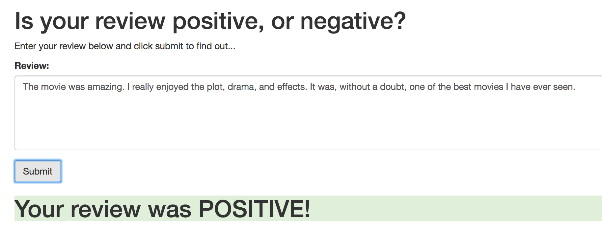

## Deploy a Sentiment Analysis Web App with PyTorch and AWS

### Project Overview
In this project I build a PyTorch LSTM classifier and deploy it as a web app on AWS to analyze the sentiment of movie reviews. In the web app, users can enter a review and get a prediction on its sentiment.

### Data
This project uses the [IMDb dataset](http://ai.stanford.edu/~amaas/data/sentiment/), which consists of 50,000 movie reviews as raw text.

### Project Files
The `deploy_sentiment_webapp_with_pytorch_aws.ipynb` notebook contains the code for retrieving the data, executing the training and testing of the PyTorch LSTM, and deploying the model as an endpoint in AWS. The directory `train` contains the files for training the classifier, and the directory `serve` has the code for making predictions in production of new reviews. The folder `website` has the web app code that displays the movie review submission form and calls the model API for making predictions.

Here is an example for a review prediction in the deployed web app:

